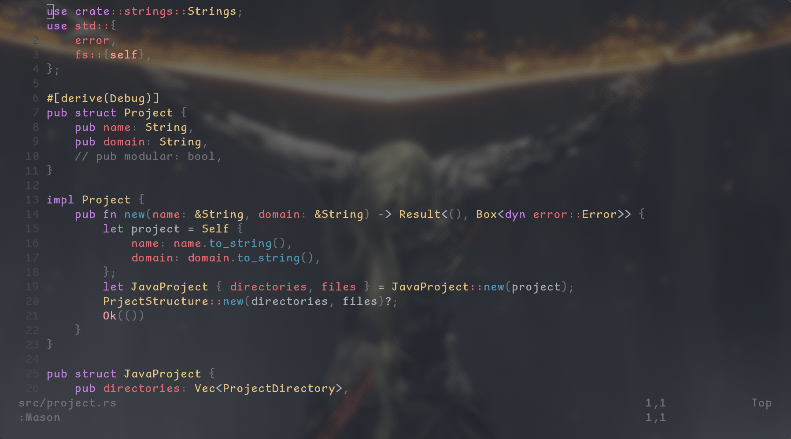
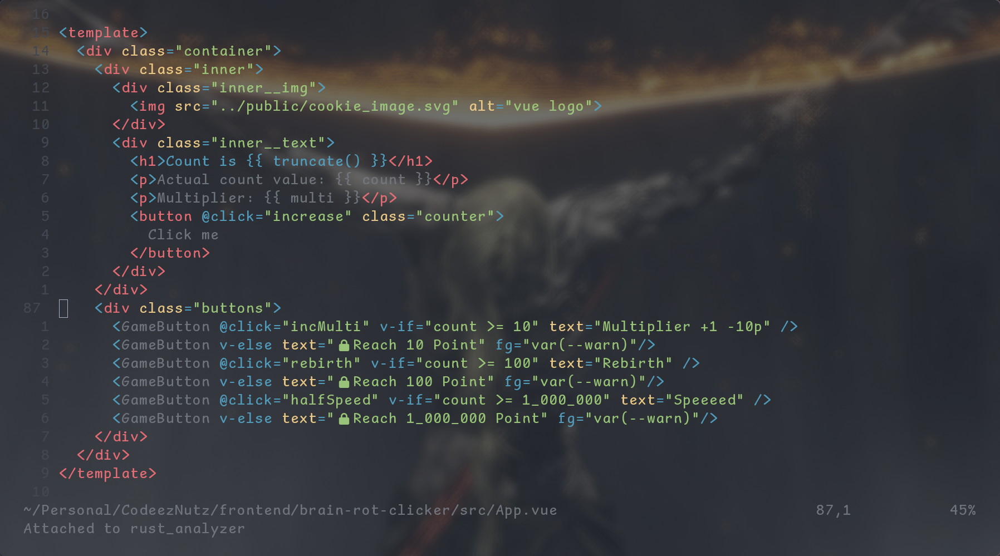
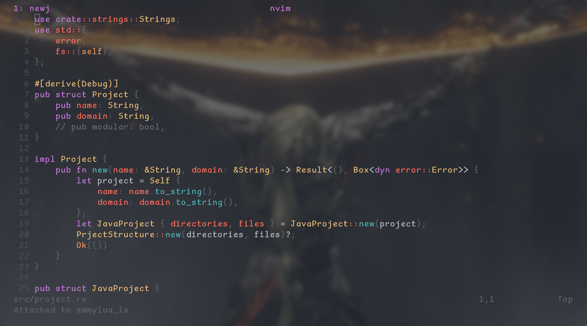
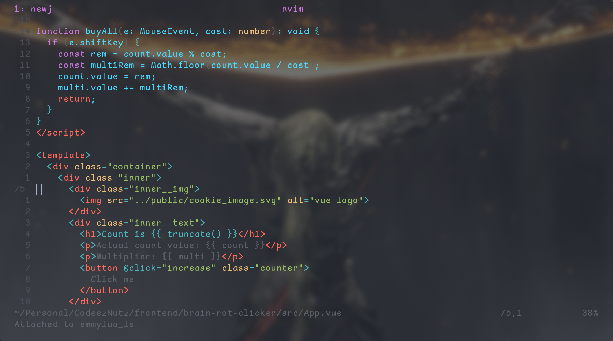

<p align="center">
Extracted version of <a href="https://github.com/nvchad/nvchad">nvchad</a> themes. 🎨
</p>

# Nvtheme - [nvchad](https://github.com/nvchad/nvchad) themes.
<!--toc:start-->
- [Installation 🔌](#installation-🔌)
- [Configuration 🛠️](#configuration-🛠️)
- [Contribution 🤝](#contribution-🤝)
- [Credits 🔥](#credits-🔥)
<!--toc:end-->

<h3> 
<details>
<summary> onedark </summary>


</details>
</h3>

<h3>
<details>
<summary> doom (called doomchad) </summary>


</details>
</h3>

# Installation 🔌
#### Requires 0 dependency

### Lazy
just return this
```lua
{
    "PoXel6/nvtheme.nvim",
    opts = {}
}

vim.cmd("colorscheme nvtheme")
```

### Nvim native package manager (pack)
```lua   
vim.pack.add({
    "github.com/PoXel6/nvtheme.nvim"
})

vim.cmd("colorscheme nvtheme")
```

# Configuration 🛠️
#### default config values:
```lua
opts = {
	theme = "onedark",
	transparency = true,
	integrations = {
		treesitter = true,
		neogit     = true,
		telescope  = true,
		lsp        = true,
		defaults   = true,
		blink      = true,
	}
}
```

### Integrations 💯
- ✅ BlinkCmp
- ✅ Telescope
- ✅ Treesitter
- ✅ Neogit


# Contribution 🤝
Any contribution is welcome.

### Add new theme 🆕
1. Copy your favorite theme from the [nvchad themes](https://github.com/nvchad/base46)
2. Paste them into [nvtheme themes](./lua/nvtheme/themes/) directory location at:
`./lua/nvtheme/themes/`
3. Change to your theme in your configuration.

### Supported features 🎇
- ✅ Table for base30 colors called `colors`
- ✅ Table for base16 colors called `base16`
- ✅ Table for theme specific highlights called `polish_hl` (please drop the name of the integration and only add your configuration to the `polish_hl` table)

### Fix bugs 🐛
Just open an issue or PR about it.

# Credits 🔥
#### All credits goes to [nvchad](https://github.com/nvchad/) peoples and theme creators.

